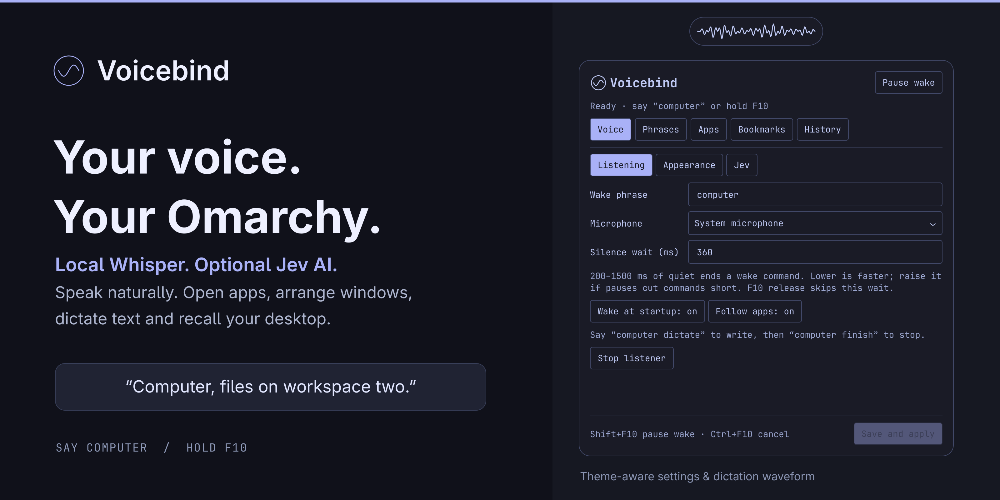
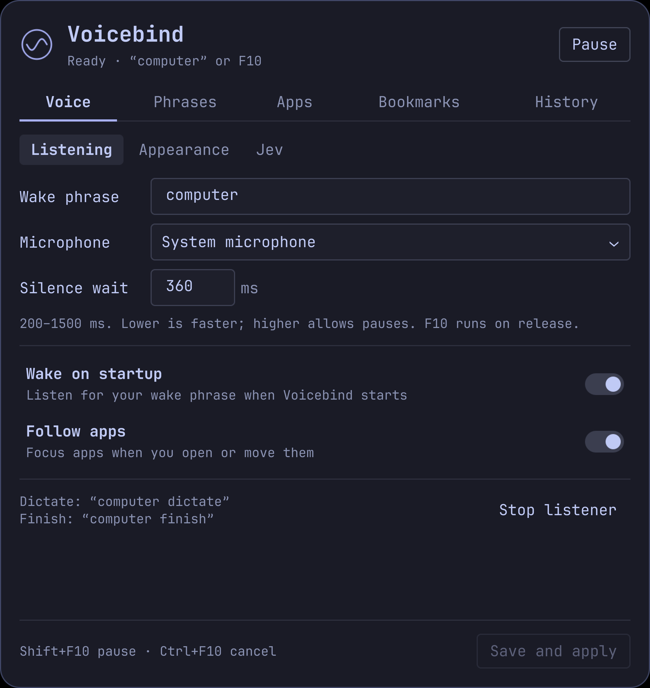
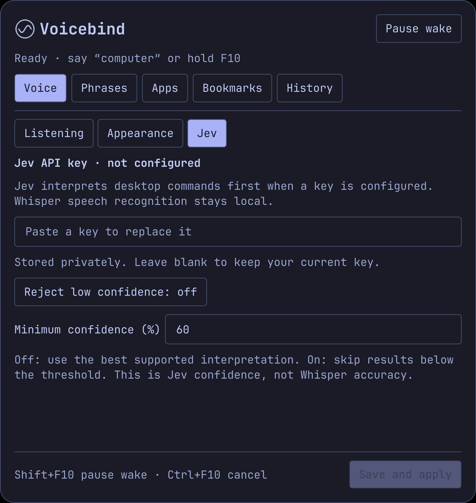
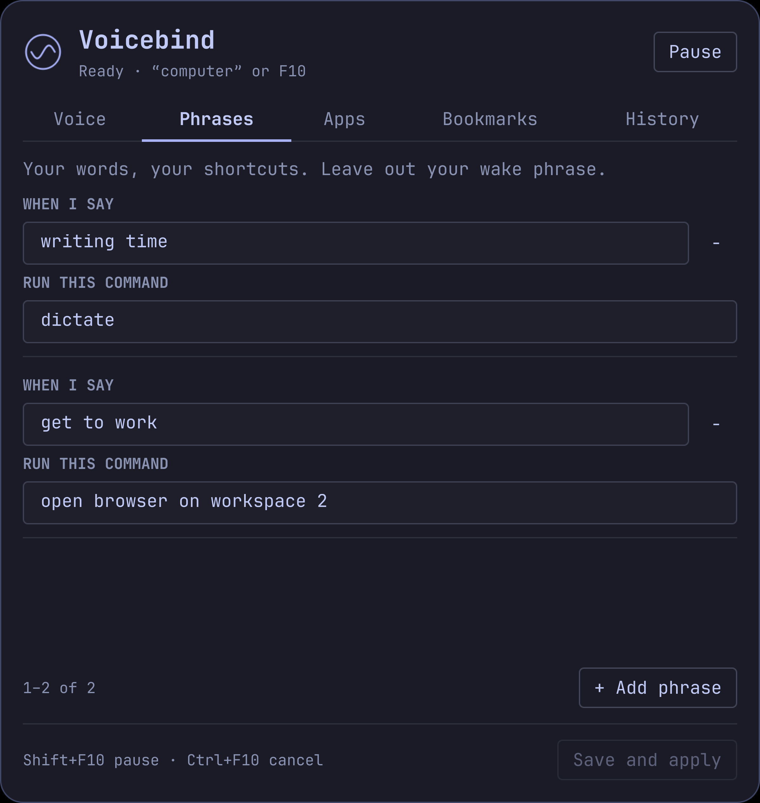

# Voicebind

Natural voice control for Omarchy with **Jev AI** and **local Whisper**.
Say **“computer”** or hold **F10**, then speak.

Open apps, move windows, chain commands, dictate text and recall saved workspace
arrangements. Local Whisper handles speech recognition. With a Jev API key, Jev
interprets desktop commands first. Local interpretation remains available without
a key or when the API is unavailable.



**Current public preview: 0.7.2.** Tested on Omarchy 4.0.3 with Hyprland 0.56.2,
Lua configuration and the Quickshell bar. Older Waybar/Hyprland configurations
are not supported. English speech and commands only at present.

## What it does

- App names that fit how you speak: “browser”, “files”, installed app names and your own aliases.
- Commands such as “move this app to workspace five, make it full screen and close Teams”.
- Dictation into a focused text field, a named app or the browser address bar.
- **Bookmarks:** save and recall a set of windows and workspaces using a phrase.
- A small themed circle that expands into a live waveform pill during dictation.
- A native bar extension for listening settings, personal phrases, apps, bookmarks and history.
- Quiet feedback through the indicator and history, with no notification for every command.

Voicebind controls supported desktop operations, not every Omarchy operation or
arbitrary buttons inside applications. Run `voicebind capabilities` for the
implemented action catalogue. Chains contain up to four actions; workspaces are 1–20.

## Install

Run these commands as your normal user in an unlocked Omarchy session.
The marketplace plugin requires a one-time backend setup; adding the bar icon alone
does not start recording. Keep the plugin folder in place: the service runs from it.

Backend setup supports CPython 3.12–3.14 (standard GIL builds) on Linux/glibc 2.27+
x86_64 and aarch64. Desktop integration is tested on x86_64 Omarchy.
Prerequisites are Python, `whisper-server`, `parecord`, `pactl`, `wpctl`,
`wtype`, `uwsm-app`, `curl`, `flock`, Hyprland and the Omarchy Quickshell bar.
Most are already part of Omarchy. On a compatible, up-to-date Omarchy installation:

```bash
sudo pacman -S --needed git python python-pip whisper-cpp libpulse wtype curl
omarchy plugin add https://github.com/tenfingerseddy/voicebind.git --enable
cd ~/.config/omarchy/plugins/io.github.tenfingerseddy.voicebind
python3 install.py --check
python3 install.py --start
```

By running `install.py --start`, you opt into the microphone service and the
shortcut changes below. Omitting `--start` prepares the backend only.

The installer creates a private Python environment, installs a SHA-256-verified
NumPy wheel from the checked-in [requirements lock](requirements.txt), downloads the
148 MB Whisper `base.en` model and checks its SHA-256 checksum. It writes a user
service and a `~/.local/bin/voicebind` command. `--start` also installs the bar
extension, assigns **F10**, **Shift+F10** and **Ctrl+F10**, and enables listening
at login. Existing bindings and affected desktop files are backed up.

Python dependency installation enforces `--require-hashes` and `--only-binary=:all:`.
Only the six locked NumPy wheels (three Python versions × two architectures) are
accepted. Setup reinstalls from a verified wheel even if the same version is already
present. Unsupported runtimes or changed artifacts fail setup; source builds and
unhashed dependencies are never a fallback. See [dependency verification](DEPENDENCIES.md).

An existing `omarchy-voice.service` is stopped and disabled to prevent two microphone
listeners. Review or move any personal bindings on those three keys before starting.
Your native F9 dictation binding is not changed. No root service is installed;
only the package prerequisites above require administrator access.

Models and Python dependencies live in `~/.local/share/voicebind/`. History,
service diagnostics and rollback backups live in `~/.local/state/voicebind/`.
`XDG_DATA_HOME` and `XDG_STATE_HOME` are respected. These files stay outside the
plugin checkout so Omarchy can validate, update and remove it safely.

To prepare without starting the listener or changing the bar/shortcuts, omit
`--start`. You can reuse an existing model with
`python3 install.py --model /path/to/ggml-base.en.bin`.
Then run `~/.local/bin/voicebind start` when ready. If `voicebind` is not on your
PATH, use that full command path or add `~/.local/bin` to your PATH.

Click the circle-and-wave bar icon to open settings. Start with the default microphone
and say **“computer open files”**, or hold F10, say **“open files”**, and release.

## Make it yours

The settings popup has five tabs and uses pages rather than scrolling:

| Tab | Settings |
| --- | --- |
| Voice | Listening: wake phrase, microphone, silence wait, focus behavior. Appearance: indicator size and position. Jev: API key, confidence rejection and threshold. |
| Phrases | Map your own wording or recurring recognition slips to supported commands. |
| Apps | Assign installed applications to everyday names and personal aliases. |
| Bookmarks | Save, restore and edit desktop arrangements and their spoken phrases. |
| History | Inspect results, errors and timing details. |

For example, map **“writing time” → “dictate”**, or **“get to work” →
“open Teams on workspace five”**. Phrases match the whole command after the wake
word; they do not rewrite dictated prose or train an acoustic model.

**Save and apply** preserves other configuration and restarts the listener when
idle. Advanced settings are documented in [config.example.toml](config.example.toml).
The private config lives at `~/.config/jev-voice/config.toml` (or under
`$XDG_CONFIG_HOME`). Internal `jev-voice` service, socket and config names are
retained for compatibility. The plugin ID is `io.github.tenfingerseddy.voicebind`.

The **silence wait** is how long a wake command must go quiet before recognition
finishes: 200–1500 ms, default 360 ms. Lower it for faster responses; raise it if
pauses between words cut commands short. Releasing F10 skips this wait. History
shows total time from end of speech or F10 release, plus component timings.

## Optional Jev classifier

Common supported commands, personal phrases and dictation work without an API key.
To use Jev as the first desktop-command interpreter, enter your own key under
**Voice → Jev**, or run:

```bash
voicebind key
systemctl --user restart jev-voice.service
```

Blank input in the settings panel keeps the existing key. Keys are stored separately
with mode 0600. `JEV_API_KEY` and `TYPESAFE_API_KEY` environment overrides are also
supported; the legacy `~/.config/typesafe/env` file is read if no newer key exists.
The adapter currently uses `api.typesafe.ai/v1/systemone`, model `jev-1.13.0`;
`VT_JEV_MODEL` overrides the model. It is not a generic OpenAI-compatible endpoint.
Provider access and charges are separate from Voicebind.

**Voice → Jev → Reject low confidence** controls how uncertain interpretations
are handled. It defaults to **off**: use Jev's highest-probability supported action,
without rejecting it for a low score. Turn it **on** to skip interpretations below
**Minimum confidence (%)**, adjustable from 0–100 (initially 60). History explains
the score and threshold for skipped commands. This measures Jev's interpretation,
not Whisper's transcription accuracy. Missing targets, unsupported operations and
execution errors can still prevent a command from running; this setting does not
invent a missing app or workspace. Cancellation and destructive-action confirmation
are unchanged.

Jev receives each ordinary desktop command when configured, including familiar
phrases. This adds an API round trip. Dictation controls, saved bookmarks and
cancellation remain local. If the API fails, commands understood locally still work.

## Screenshots

The screenshots show the real settings components with example configuration in a
Tokyo Night palette. The preview waveform uses illustrative audio samples. Your
settings panel and listening indicator follow your current Omarchy theme.

<details>
<summary>Listening settings, Jev API key and personal phrases</summary>

### Listening settings



### Jev interpretation

Add your own Jev API key for more flexible command phrasing. Whisper speech
recognition stays local; Jev receives command text when semantic interpretation is needed.



### Your phrases



</details>

## Speaking to the desktop

Try these with the wake phrase or by holding F10:

- “Computer files workspace two.”
- “Computer browser on three.”
- “Computer files workspace two then make it full screen.”
- “Computer bring up the browser.”
- “Computer open files on workspace five then make it full screen.”
- “Computer move this app to workspace two and close Teams.”
- “Computer show notifications.”
- “Computer open quick settings.”
- “Computer set volume to forty percent.”
- “Computer turn on night light.”
- “Computer voice settings.”

An app name and destination are enough: **“files workspace two”** opens Files
there if closed, moves an existing window there if needed, or focuses it if already
present. This applies to installed app names and aliases, without defining a custom
phrase. Shorthand works locally without a key. With a key, Jev handles both shorthand
and broader phrasing such as **“could I have files over on two”**. Named-app
placement also opens a closed app when the request is interpreted as “move”.

Within a chain, **it/that window** refers to the previous window operation.
**This app/this window** refers to the window focused when speech began.
Give an app name when closing a different app. Available bar panels depend on
the plugins installed and enabled on your machine.

Ordinary valid commands execute immediately. Shutdown, reboot, logout, closing all
windows and replacing/deleting bookmarks require **“computer yes”** within eight
seconds. Missing required values, such as a workspace number, need a follow-up.
**Ctrl+F10** cancels; **Shift+F10** toggles wake listening for the session.
Saying only “computer” opens a five-second turn for the next command.

## Dictation

Focus a text field and say **“computer dictate”**. “Open dictation”, “dictate this”
and “begin dictation” also work. The circle expands into a waveform pill.
Speak, pause briefly, then say **“computer stop”** or **“computer finish”**.
The ending phrase is removed before text is inserted.

- Tap **F10** to finish without a spoken ending.
- Say **“computer cancel”** or press **Ctrl+F10** to discard the recording.
- “Computer dictate in browser address bar” focuses your browser's address bar.
- “Computer dictate in Teams” uses the compose-box shortcut; select a conversation first.
- “Computer dictate in [app]” opens/focuses that app and uses its current input field.

Text appears when you finish, not word by word. Recording is limited to about
55 seconds. Voicebind does not press Enter or send messages. Newlines become
spaces. Dictation reuses the existing microphone stream and local Whisper model.

Keep the same text field focused. Voicebind checks the window/panel identity,
not the individual caret within it. If the input surface changes, the desktop
locks, or the ending phrase cannot be separated confidently, it saves a private
recovery draft instead of typing. Use `voicebind dictation-draft` to retrieve it.

## Bookmarks

Arrange your windows, then say **“computer save bookmark work mode”**.
Later say **“computer work mode”** or **“computer restore bookmark work mode”**.
Add other phrases in the Bookmarks tab.

Bookmarks save normal workspaces, window placement, floating geometry,
fullscreen state and focus. Missing apps can reopen using installed desktop
entries. Disconnected monitors fall back to available displays.

They do not restore browser tabs, documents, terminal contents, unsaved work or
the exact tiling split tree. Special/grouped/pinned/swallowed windows are excluded.
Ambiguous window matches can require attention. Unrelated windows are left open.

## Privacy

Speech recognition runs locally. Raw microphone audio stays in memory; unrelated
room speech is not written to command history. Addressed command transcripts,
outcomes and timings are stored locally in `~/.local/state/voicebind/sessions/`
(or under `$XDG_STATE_HOME`).
History displays the latest entries; session files are not automatically pruned.

If you configure a Jev key, desktop-command interpretation sends each command
transcript and relevant command/app choices to Jev. Dictation bodies and saved bookmark window
titles are not sent to Jev. There is no analytics service in Voicebind.

Configuration, keys, bookmarks and recovery drafts are private local files. A failed
dictation handoff retains only the latest recovery draft. Session logs, model files,
recordings and personal configuration are excluded from this repository.
Review diagnostics before posting them publicly: commands can contain personal text.

## Maintain or remove

```bash
voicebind status                 # listener state and microphone holders
voicebind log                    # recent user-service diagnostics
voicebind stop                   # stop for this session
voicebind start                  # start and enable at login
voicebind text computer open files  # plan a command without executing it

# Update the plugin and its backend dependencies:
voicebind stop
omarchy plugin update io.github.tenfingerseddy.voicebind
python3 ~/.config/omarchy/plugins/io.github.tenfingerseddy.voicebind/install.py
voicebind start
omarchy restart shell

# Remove the backend FIRST, then the plugin:
voicebind uninstall
omarchy plugin remove io.github.tenfingerseddy.voicebind
```

The listener is a separate user service. Disabling or removing the bar plugin
alone does not uninstall that service or its shortcuts. Use both removal commands
in the order above. Uninstall stops and disables the listener, removes its launcher
and command, and restores backed-up shortcuts. A previous command/service file is
restored if present; a previous voice service is not automatically started.
Settings, keys, bookmarks, models, history and backups are retained outside the
plugin folder. Delete those personal files separately only if you no longer want them.

If you replaced the earlier Voicebind app and want it running again, use
`voicebind original` instead. Other voice daemons should not run alongside Voicebind.

### Existing manual installations

A checkout outside the plugin folder is still supported: `git pull --ff-only`,
`python3 install.py`, then `voicebind stop` and `voicebind start`. Setup copies old
checkout-local history and rollback backups to the state folder when none already
exist, and reuses a valid local model. The original files are kept.

To move a manual installation to Omarchy's plugin manager, first run
`voicebind uninstall`, then remove its disabled bar plugin with
`omarchy plugin remove io.github.tenfingerseddy.voicebind` (older releases use
`jev-voice`). Follow the installation steps above. Existing config, app aliases,
API key and bookmarks continue to work. Do not run setup from a second checkout
while Omarchy already manages the plugin.

## Development

```bash
python3 -m venv /tmp/voicebind-dev-venv
/tmp/voicebind-dev-venv/bin/python -m pip --isolated install --require-hashes --only-binary=:all: -r requirements.txt
/tmp/voicebind-dev-venv/bin/python -m unittest discover -s tests -q
omarchy plugin validate .
```

These tests use synthetic fixtures and mocked desktop actions. They do not need an
API key or model. Qt 6 layout/paging tests are described in [tests/qml/README.md](tests/qml/README.md).
To check the real classifier separately, run `/tmp/voicebind-dev-venv/bin/python tests/check_jev.py`.
This optional check uses your Jev key and normal API usage, with synthetic app
names and prepared plans; it never executes desktop actions.
Testing on other machines, microphones and themes is welcome. See
[CONTRIBUTING.md](CONTRIBUTING.md) for useful bug-report details.

The desktop components retain their original [MIT notice](desktop_core/LICENSE).
Voicebind is [MIT licensed](LICENSE). The model is downloaded separately from the
[whisper.cpp model repository](https://huggingface.co/ggerganov/whisper.cpp), as used
by the [upstream downloader](https://github.com/ggml-org/whisper.cpp/blob/master/models/download-ggml-model.sh).
